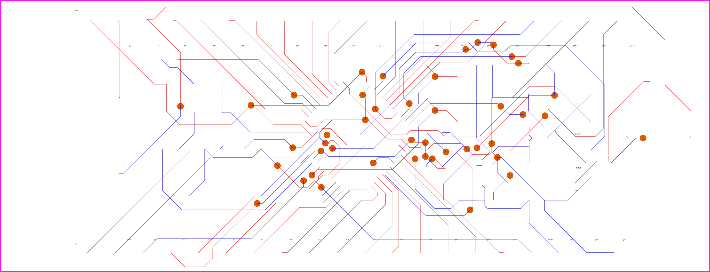

# STM32 最小系统板设计与 VHDL 逻辑验证

> 湖南涉外经济学院 · 信息与机电工程学院 · 电子信息工程（电信 2303）
> EDA 技术课程设计 · 2025.12 · 三人小组（组长：胡凯旋）

一次把「硬件设计 → PCB → 逻辑仿真」全流程走通的课程设计：用**嘉立创 EDA 专业版**完成基于 **STM32F103C8T6** 的两层最小系统板（原理图 + PCB），打样焊接后上电点亮验证；同时用 **Quartus II + VHDL** 完成 8 选 1 数据选择器、带使能端 3-8 线译码器、6/60 进制计数器等逻辑模块的设计与波形仿真。

---

## 一、硬件设计

### 1.1 板子概览



> 上图由工程内的 PCB 源文件解析生成：**红色 = 顶层走线，蓝色 = 底层走线，橙色圆点 = 过孔**（丝印文字：vcc / gnd / reset / pa_ / pb_ 等）。
> 顶层、底层分开的版本见 `images/pcb-top-layer.png`、`images/pcb-bottom-layer.png`。

### 1.2 关键参数

| 项目 | 参数 |
| --- | --- |
| 主控 | STM32F103C8T6（ARM Cortex-M3，64 KB Flash / 20 KB SRAM，LQFP48） |
| 板层 | **2 层**（Top / Bottom + 丝印），板框约 **65 × 25 mm** |
| 规模 | 30 个元件 · 44 个过孔 · 156 个焊盘 · 49 个网络 |
| 供电 | USB 5V 输入 → AMS1117-3.3 线性稳压（输入 22uF、输出 10uF/22uF + 0.1uF/10nF 去耦） |
| 时钟 | 8 MHz 主晶振（22pF 负载电容）+ 32.768 kHz RTC 晶振 |
| 调试 | SWD 两线调试口（SWCLK / SWDIO），2×3 排针引出 |
| 复位与启动 | NRST 复位电路、BOOT0 / BOOT1 启动模式跳线 |
| 交互与外设 | USB 接口（D+/D−）、用户 LED、轻触按键、I/O 全引出（2×20P 排针） |
| 设计工具 | 嘉立创 EDA 专业版（原理图 + PCB 一体） |

### 1.3 设计过程

| 日期 | 阶段 | 证据文件 |
| --- | --- | --- |
| 2025-12-22 | 原理图设计（A4 图框，`Schematic1`） | `hardware/backup/最小系统板_v39_2025-12-22-11-32.zip` |
| 2025-12-23 | 原理图方案实施与器件核对 | `..._v51_2025-12-23-09-59.zip` |
| 2025-12-24 | PCB 布局布线 | `..._v54_2025-12-24-10-56.zip` |
| 2025-12-26 | 工程交付 + 答辩 | `hardware/最小系统板.eprj`、`docs/最小系统板讲解.pptx` |

PCB 布局要点：电源走线加宽、底层过孔回连缩短回路、晶振紧靠主控放置且下方不走信号线、I/O 按端口顺序引出便于飞线。

之后**完成打样与焊接，上电测试通过（供电正常、LED 点亮）**。

---

## 二、软件设计（VHDL / Quartus II）

平台：Quartus II 13.0 SP1，目标器件 Cyclone IV E `EP4CE40F29C6`（与原工程一致）。

| 模块 | 源文件 | 实现要点 | 验证方式 |
| --- | --- | --- | --- |
| 8 选 1 数据选择器 | `vhdl/sel8_1/sel8_1.vhd` | `process` + `if-elsif` 优先级分支，3 位选择信号选通 8 路数据 | `sel8_1_tb.vhd` 自检式 testbench（见下） |
| 带使能端 3-8 线译码器 | `vhdl/yima3_8/yima3_8.vhd` | 条件信号赋值 `when…else`，8 路**低电平有效**输出，E0/E1/E2 使能端 | `yima3_8.vwf` 波形仿真（逐行对照真值表） |
| 半加器 | `vhdl/banjiaqi01/banjiaqi01.vhd` | 组合逻辑 | `banjiaqi01.vwf` 波形仿真 |
| 6 进制计数器 | `vhdl/counter/jinzhi6.vhd` | 异步复位 + 同步使能 + 进位输出 | — |
| 60 进制计数器 | `vhdl/counter/jinzhi60.vhd` | 个位（0-9）+ 十位（0-5）两级计数 | — |
| 09→99 计数与打包 | `vhdl/counter/zzz.vhd` | `for…loop` + `case` 实现个位/十位进位与打包标志 | — |

### 2.1 关于 8 选 1 选择器

原始工程文件在整理时已丢失（仅保留编辑器截图 `images/quartus-sel8_1截图.png`），本仓库按当时的实现思路重新整理为可直接运行的源码：

- `sel8_1.vhd` —— 与截图一致的 `entity sel8_1 / architecture rtl`（`if s="000" then y<=d(0); … elsif s="111" then y<=d(7);`）；
- `sel8_1_tb.vhd` —— 自检式 testbench：对 `s` 遍历 000~111，逐路把对应数据位置 1，检查 `y` 是否被正确选中，输出 `PASS/FAIL` 与错误计数；
- `sel8_1.qpf` / `sel8_1.qsf` —— 与其余工程同器件的 Quartus 工程文件，可直接打开编译。

> 说明：这两份是**按当时的编辑器截图与实现思路整理的 VHDL-93 源码**，整理时本机没有安装 Quartus / ModelSim，**未做本地编译验证**；若在你的环境里编译报错，欢迎提 issue，我会一并修正。

**ModelSim 命令行仿真**（Quartus 自带 ModelSim-Altera Starter 即可）：

```tcl
# 在 vhdl/sel8_1 目录下
vsim -do sim.do
```

或直接在 Quartus 里 `Tools → Run Simulation Tool → RTL Simulation`。

---

## 三、目录结构

```
.
├─ hardware/
│  ├─ 最小系统板.eprj                  # 嘉立创 EDA 专业版工程（原理图 + PCB，双击导入）
│  └─ backup/                          # 12-22 / 12-23 / 12-24 三个版本快照
├─ vhdl/
│  ├─ sel8_1/                          # 8 选 1 数据选择器（源码 + testbench + Quartus 工程）
│  ├─ yima3_8/                         # 带使能端 3-8 线译码器（源码 + .vwf 波形）
│  ├─ banjiaqi01/                      # 半加器（源码 + .vwf 波形）
│  └─ counter/                         # 6 进制 / 60 进制计数器、09→99 计数与打包
├─ docs/
│  ├─ EDA技术课程设计报告.docx
│  └─ 最小系统板讲解.pptx              # 答辩/讲解 PPT
└─ images/
   ├─ pcb-overview.png                 # PCB 走线总览（顶层 + 底层）
   ├─ pcb-top-layer.png / pcb-bottom-layer.png
   └─ quartus-sel8_1截图.png / quartus-yima3_8截图.png
```

## 四、如何打开

- **原理图 / PCB**：安装嘉立创 EDA 专业版 → 打开 `hardware/最小系统板.eprj` 导入工程；或用版本快照 `.zip` 恢复历史版本。
- **VHDL / 波形**：Quartus II 13.0 打开对应 `.qpf` 工程；`.vwf` 为 Quartus 波形文件，`File → Open` 后用 `Simulation → Run Functional Simulation` 复现波形。
- **文本查看**：所有 `.vhd` 均为 UTF-8（含中文注释），在 GitHub 上可直接阅读。

## 五、结论

- 硬件侧走通了「选型 → 原理图 → PCB → 打样 → 焊接 → 上电验证」完整链路，掌握两层板的电源与晶振布局、过孔回连、调试口预留等工程习惯；
- 逻辑侧用 VHDL 覆盖了组合逻辑（选择器 / 译码器 / 加法器）与时序逻辑（计数器）两类基本模块，并用波形文件逐行验证真值表；
- 团队成员分工：组长负责整体方案、原理图 / PCB 设计与程序开发，并完成报告撰写与答辩。

## 六、备注

- 仓库内 PCB 图片由工程源文件解析绘制，用于快速预览；**正式的丝印、覆铜、3D 效果请以嘉立创 EDA 中打开工程为准**。
- 若需要 Gerber / BOM 等生产文件，可在嘉立创 EDA 中 `制造 → 导出 Gerber`。
